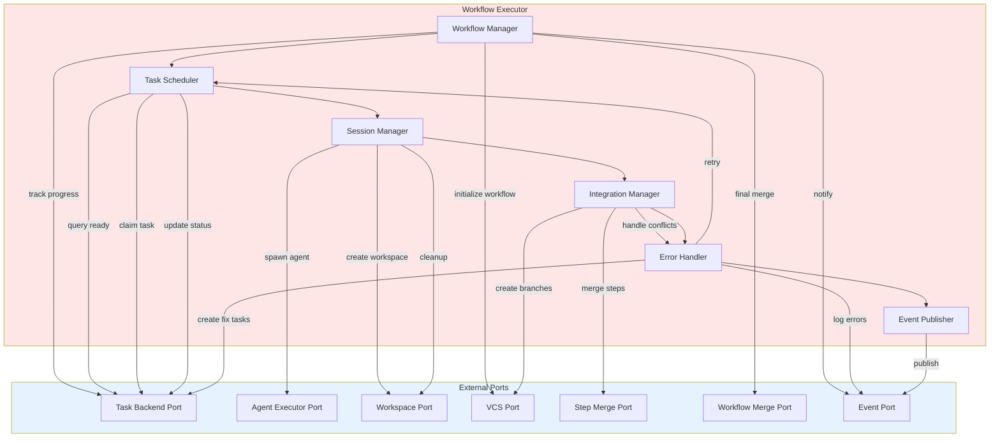

# Workflow Executor - Detailed Design

## Executive Summary

The Workflow Executor is the core orchestration component that coordinates the execution of workflow templates by traversing task DAGs, managing execution sessions, and integrating with all system ports. This document describes the executor's internal architecture, key components, and how they work together to deliver reliable, restartable workflows.

## Overview

The Workflow Executor sits at the heart of the system, acting as the conductor that:
- Translates high-level workflow templates into concrete execution steps
- Manages the lifecycle of task execution sessions
- Coordinates interactions between all ports (Task Backend, Agent, Workspace, VCS, Merge Policies, Events)
- Enforces execution policies and quality gates
- Handles failures and recovery

## Core Responsibilities

1. **Workflow Lifecycle Management**
   - Initialize workflow branches
   - Track workflow state and progress
   - Coordinate workflow completion and cleanup

2. **Task Orchestration**
   - Query ready tasks from backend
   - Select next task based on strategy
   - Claim tasks atomically
   - Coordinate task execution flow

3. **Session Management**
   - Create isolated workspaces for each task
   - Spawn fresh agent sessions
   - Inject context and instructions
   - Capture and process results

4. **Integration Orchestration**
   - Invoke step merge policies after task completion
   - Invoke workflow merge policy after all tasks complete
   - Coordinate with VCS for branch management
   - Handle merge failures and trigger fix agents

5. **Error Handling & Recovery**
   - Detect and classify failures
   - Implement retry strategies
   - Create fix tasks for merge failures
   - Preserve debugging artifacts

6. **Event & Progress Tracking**
   - Emit execution events
   - Report progress to users
   - Log execution details

## Architecture

### Component Diagram



## Key Components

### 1. Workflow Manager

**Purpose**: Manages overall workflow lifecycle from initialization to completion.

**Responsibilities**:
- Create workflow branch at start
- Track workflow-level state (running, paused, completed, failed)
- Coordinate workflow completion
- Invoke workflow merge policy
- Cleanup workflow artifacts
- Handle workflow-level errors

**Interface**:
```typescript
interface WorkflowManager {
  // Lifecycle
  initializeWorkflow(workflowId: string, baseBranch: string): WorkflowContext
  getWorkflowStatus(workflowId: string): WorkflowStatus
  pauseWorkflow(workflowId: string): void
  resumeWorkflow(workflowId: string): void
  cancelWorkflow(workflowId: string): void

  // Completion
  completeWorkflow(workflowId: string): Promise<MergeResult>
  cleanupWorkflow(workflowId: string): void
}
```

**Key Operations**:

**Initialize Workflow**:
1. Validate workflow template and parameters
2. Create workflow branch via VCS Port: `workflow/<workflow-id>` from main
3. Create workflow tracking record in Task Backend
4. Emit workflow started event
5. Return workflow context for execution

**Complete Workflow**:
1. Verify all tasks completed
2. Invoke Workflow Merge Policy Port
3. Wait for merge completion (policy handles PR, checks, approval)
4. If merge fails: delegate to Error Handler
5. If merge succeeds: mark workflow complete
6. Emit workflow completed event
7. Cleanup workflow branch (optional)

### 2. Task Scheduler

**Purpose**: Selects and schedules tasks for execution based on DAG dependencies and policies.

**Responsibilities**:
- Query ready tasks (no open blockers)
- Select next task based on strategy (priority, FIFO, custom)
- Claim task atomically to prevent duplicate execution
- Update task status as execution progresses
- Handle scheduling policies (sequential, parallel, hybrid)

**Interface**:
```typescript
interface TaskScheduler {
  // Task selection
  getReadyTasks(workflowId: string): Task[]
  selectNextTask(readyTasks: Task[], strategy: SchedulingStrategy): Task
  claimTask(taskId: string, executorId: string): boolean

  // Status updates
  markTaskInProgress(taskId: string): void
  markTaskCompleted(taskId: string, result: TaskResult): void
  markTaskFailed(taskId: string, error: Error): void

  // Scheduling control
  setSchedulingStrategy(strategy: SchedulingStrategy): void
  pauseScheduling(workflowId: string): void
  resumeScheduling(workflowId: string): void
}
```

**Scheduling Strategies**:
- **FIFO**: Execute tasks in dependency order, first created first
- **Priority**: Use task priority metadata
- **Parallel**: Execute all ready tasks concurrently (up to limit)
- **Custom**: User-defined selection logic

**Key Operations**:

**Get Next Task**:
1. Query Task Backend Port for ready tasks (no blockers)
2. Apply scheduling strategy to select task
3. Atomically claim task via Task Backend Port
4. Return task if claim succeeds, null otherwise

**Update Task Status**:
1. Update task state in Task Backend Port
2. Emit task status event
3. Trigger dependent task checks (unblock children)

### 3. Session Manager

**Purpose**: Manages isolated execution sessions for each task.

**Responsibilities**:
- Create isolated workspace for task execution
- Create task branch from workflow branch
- Spawn fresh agent session with context
- Inject task instructions and context
- Capture agent output and artifacts
- Commit changes to task branch
- Cleanup session resources

**Interface**:
```typescript
interface SessionManager {
  // Session lifecycle
  createSession(task: Task, workflowBranch: string): ExecutionSession
  executeTask(session: ExecutionSession): Promise<TaskResult>
  captureResults(session: ExecutionSession): TaskResult
  cleanupSession(session: ExecutionSession): void

  // Session management
  getActiveSessionCount(): number
  terminateSession(sessionId: string): void
  preserveSession(sessionId: string): void  // For debugging
}
```

**Execution Session Model**:
```typescript
interface ExecutionSession {
  sessionId: string
  taskId: string
  workspaceId: string
  workspacePath: string
  taskBranch: string
  agentId: string
  context: TaskContext
  startTime: Date
  status: 'initializing' | 'running' | 'completed' | 'failed'
}
```

**Key Operations**:

**Create Session**:
1. Create isolated workspace via Workspace Port
   - Creates git worktree at `.codeflow/worktrees/<task-id>/`
   - Creates task branch: `task/<task-id>` from workflow branch
2. Generate session context:
   - Task instructions and acceptance criteria
   - Parameter values
   - Workflow context
   - Previous task artifacts (if dependencies)
3. Spawn fresh agent via Agent Executor Port
4. Return session handle

**Execute Task**:
1. Inject task context into agent session
2. Start agent execution
3. Monitor agent progress
4. Wait for completion or timeout
5. Capture output and results
6. Commit changes to task branch via Workspace Port
7. Return task result

**Cleanup Session**:
1. Terminate agent session
2. Destroy workspace via Workspace Port (on success)
3. Or preserve workspace for debugging (on failure)
4. Release resources

### 4. Integration Manager

**Purpose**: Orchestrates integration of task changes into workflow branch.

**Responsibilities**:
- Invoke step merge policy after task completion
- Monitor merge status and CI/CD checks
- Handle merge conflicts and failures
- Coordinate fix agent creation
- Track merge history

**Interface**:
```typescript
interface IntegrationManager {
  // Step integration
  mergeStep(taskBranch: string, workflowBranch: string, task: Task): Promise<MergeResult>
  getMergeStatus(mergeId: string): MergeStatus
  retryMerge(mergeId: string): Promise<MergeResult>

  // Conflict handling
  detectConflicts(taskBranch: string, workflowBranch: string): boolean
  getConflictDetails(taskBranch: string, workflowBranch: string): ConflictInfo

  // Fix coordination
  createFixTask(originalTask: Task, mergeError: Error): Task
}
```

**Key Operations**:

**Merge Step**:
1. Invoke Step Merge Policy Port with task branch and workflow branch
2. Policy creates PR (or auto-merge based on configuration)
3. Policy monitors CI/CD checks via VCS Port
4. If checks fail:
   - Delegate to Error Handler
   - Error Handler creates fix task
   - Return merge failure result
5. If checks pass:
   - Policy completes merge (notify user or auto-merge)
   - Delete task branch
   - Return merge success result

**Handle Merge Failure**:
1. Capture merge error details (conflicts, CI failures)
2. Create fix task with context:
   - Original task intent
   - Merge error details
   - Conflict file list
   - CI/CD logs
3. Add dependency: fix task blocked by original task
4. Return fix task ID

### 5. Error Handler

**Purpose**: Centralized error detection, classification, and recovery orchestration.

**Responsibilities**:
- Detect and classify errors (transient, permanent, recoverable)
- Implement retry strategies
- Create fix tasks for recoverable errors
- Log error details for debugging
- Escalate unrecoverable errors to user
- Preserve debugging artifacts

**Interface**:
```typescript
interface ErrorHandler {
  // Error handling
  handleTaskError(task: Task, error: Error): ErrorResolution
  handleMergeError(task: Task, mergeError: MergeError): ErrorResolution
  handleWorkflowError(workflow: Workflow, error: Error): ErrorResolution

  // Retry logic
  shouldRetry(error: Error, attemptCount: number): boolean
  getRetryDelay(attemptCount: number): number

  // Fix task creation
  createFixTask(context: FixContext): Task

  // Escalation
  escalateToUser(error: Error, context: string): void
}
```

**Error Classification**:
```typescript
enum ErrorType {
  // Transient - retry automatically
  NetworkTimeout = 'network_timeout',
  AgentTimeout = 'agent_timeout',
  ResourceUnavailable = 'resource_unavailable',

  // Recoverable - create fix task
  MergeConflict = 'merge_conflict',
  CIFailure = 'ci_failure',
  TestFailure = 'test_failure',
  BuildFailure = 'build_failure',

  // Permanent - escalate to user
  InvalidTemplate = 'invalid_template',
  MissingDependency = 'missing_dependency',
  ConfigurationError = 'configuration_error',
  AuthenticationError = 'authentication_error'
}
```

**Retry Strategy**:
```typescript
interface RetryPolicy {
  maxAttempts: number           // Default: 3
  backoffMultiplier: number     // Default: 2 (exponential)
  baseDelay: number             // Default: 1000ms
  maxDelay: number              // Default: 30000ms
}
```

**Key Operations**:

**Handle Task Error**:
1. Classify error type
2. If transient and within retry limit:
   - Log retry attempt
   - Return retry resolution
3. If recoverable:
   - Create fix task
   - Return fix task resolution
4. If permanent:
   - Mark task failed
   - Preserve workspace for debugging
   - Escalate to user
   - Return escalation resolution

**Handle Merge Error**:
1. Classify merge error (conflict, CI failure, timeout)
2. Create fix task with:
   - Original task context
   - Merge error details
   - Files with conflicts
   - CI/CD failure logs
3. Add fix task to workflow DAG
4. Return fix task ID

### 6. Event Publisher

**Purpose**: Publishes execution events for monitoring, logging, and user notification.

**Responsibilities**:
- Emit structured events for all execution activities
- Route events to configured event streams
- Support multiple event consumers
- Provide event filtering and routing

**Interface**:
```typescript
interface EventPublisher {
  // Event publishing
  publishEvent(event: ExecutionEvent): void
  publishBatch(events: ExecutionEvent[]): void

  // Subscription management
  subscribe(filter: EventFilter, handler: EventHandler): string
  unsubscribe(subscriptionId: string): void
}
```

**Event Types**:
```typescript
enum EventType {
  // Workflow events
  WorkflowStarted = 'workflow.started',
  WorkflowPaused = 'workflow.paused',
  WorkflowResumed = 'workflow.resumed',
  WorkflowCompleted = 'workflow.completed',
  WorkflowFailed = 'workflow.failed',

  // Task events
  TaskScheduled = 'task.scheduled',
  TaskClaimed = 'task.claimed',
  TaskStarted = 'task.started',
  TaskCompleted = 'task.completed',
  TaskFailed = 'task.failed',

  // Session events
  SessionCreated = 'session.created',
  SessionExecuting = 'session.executing',
  SessionCompleted = 'session.completed',
  SessionTerminated = 'session.terminated',

  // Merge events
  MergeStarted = 'merge.started',
  MergeWaitingForChecks = 'merge.waiting_for_checks',
  MergeWaitingForApproval = 'merge.waiting_for_approval',
  MergeCompleted = 'merge.completed',
  MergeFailed = 'merge.failed',

  // Error events
  ErrorDetected = 'error.detected',
  RetryAttempt = 'error.retry',
  FixTaskCreated = 'error.fix_task_created',
  ErrorEscalated = 'error.escalated'
}
```

## Execution Flow

### Main Execution Loop

```typescript
async function executeWorkflow(workflowId: string): Promise<WorkflowResult> {
  // Phase 1: Initialization
  const context = workflowManager.initializeWorkflow(workflowId, 'main')
  eventPublisher.publishEvent({
    type: EventType.WorkflowStarted,
    workflowId,
    timestamp: Date.now()
  })

  try {
    // Phase 2: Task Execution Loop
    while (await hasIncompleteTasks(workflowId)) {
      // 2.1 Get next ready task
      const readyTasks = await taskScheduler.getReadyTasks(workflowId)
      if (readyTasks.length === 0) {
        // All remaining tasks are blocked - check for deadlock
        if (await isDeadlocked(workflowId)) {
          throw new Error('Workflow deadlocked - circular dependencies detected')
        }
        // Wait for tasks to unblock (e.g., fix tasks to complete)
        await sleep(5000)
        continue
      }

      const task = await taskScheduler.selectNextTask(readyTasks, strategy)
      const claimed = await taskScheduler.claimTask(task.id, executorId)
      if (!claimed) {
        // Another executor claimed it - try next task
        continue
      }

      // 2.2 Create execution session
      const session = await sessionManager.createSession(task, context.workflowBranch)
      eventPublisher.publishEvent({
        type: EventType.SessionCreated,
        taskId: task.id,
        sessionId: session.sessionId
      })

      // 2.3 Execute task
      taskScheduler.markTaskInProgress(task.id)
      const result = await sessionManager.executeTask(session)

      // 2.4 Handle result
      if (result.success) {
        // 2.4a Success path
        // Commit changes to task branch (already done by session manager)

        // Merge step to workflow branch
        const mergeResult = await integrationManager.mergeStep(
          session.taskBranch,
          context.workflowBranch,
          task
        )

        if (mergeResult.success) {
          // Mark task complete
          taskScheduler.markTaskCompleted(task.id, result)
          sessionManager.cleanupSession(session)

          eventPublisher.publishEvent({
            type: EventType.TaskCompleted,
            taskId: task.id,
            timestamp: Date.now()
          })
        } else {
          // Merge failed - create fix task
          const fixTask = await errorHandler.handleMergeError(task, mergeResult.error)
          sessionManager.preserveSession(session)  // Keep for fix task

          eventPublisher.publishEvent({
            type: EventType.FixTaskCreated,
            originalTaskId: task.id,
            fixTaskId: fixTask.id
          })
        }
      } else {
        // 2.4b Failure path
        const resolution = await errorHandler.handleTaskError(task, result.error)

        if (resolution.type === 'retry') {
          // Retry the task
          await sleep(resolution.retryDelay)
          sessionManager.cleanupSession(session)
          // Task remains claimed, will retry in next iteration
        } else if (resolution.type === 'fix_task') {
          // Fix task created
          taskScheduler.markTaskFailed(task.id, result.error)
          sessionManager.preserveSession(session)
        } else {
          // Escalate to user
          taskScheduler.markTaskFailed(task.id, result.error)
          sessionManager.preserveSession(session)
          throw new Error(`Task ${task.id} failed: ${result.error.message}`)
        }
      }
    }

    // Phase 3: Workflow Completion
    const finalMerge = await workflowManager.completeWorkflow(workflowId)
    if (!finalMerge.success) {
      // Workflow merge failed - create fix task and return to loop
      const fixTask = await errorHandler.handleMergeError(
        { id: workflowId, type: 'workflow' },
        finalMerge.error
      )
      // Loop will continue with fix task
      return executeWorkflow(workflowId)  // Recursive call
    }

    // Success!
    workflowManager.cleanupWorkflow(workflowId)

    eventPublisher.publishEvent({
      type: EventType.WorkflowCompleted,
      workflowId,
      timestamp: Date.now()
    })

    return { success: true, workflowId }

  } catch (error) {
    // Workflow-level failure
    eventPublisher.publishEvent({
      type: EventType.WorkflowFailed,
      workflowId,
      error: error.message,
      timestamp: Date.now()
    })

    throw error
  }
}
```

## Pluggability & Extension

### Scheduling Strategies

Custom scheduling strategies can be plugged in:

```typescript
interface SchedulingStrategy {
  selectTask(readyTasks: Task[], context: WorkflowContext): Task
}

// Example: Priority-based with deadline awareness
class DeadlineAwareScheduler implements SchedulingStrategy {
  selectTask(readyTasks: Task[], context: WorkflowContext): Task {
    return readyTasks.reduce((highest, task) => {
      const urgency = this.calculateUrgency(task, context)
      return urgency > this.calculateUrgency(highest, context) ? task : highest
    })
  }

  private calculateUrgency(task: Task, context: WorkflowContext): number {
    // Factor in priority, deadline, blocking tasks count, etc.
    return task.priority + (this.daysUntilDeadline(task) * -10) +
           (task.blockedTasks.length * 5)
  }
}
```

### Error Handlers

Custom error handling strategies:

```typescript
interface ErrorResolutionStrategy {
  resolve(error: Error, context: ErrorContext): ErrorResolution
}

// Example: ML-based error resolution
class MLErrorResolver implements ErrorResolutionStrategy {
  resolve(error: Error, context: ErrorContext): ErrorResolution {
    const errorPattern = this.extractPattern(error)
    const historicalResolution = this.mlModel.predict(errorPattern, context)

    if (historicalResolution.confidence > 0.8) {
      return historicalResolution.resolution
    }

    // Fall back to default strategy
    return this.defaultStrategy.resolve(error, context)
  }
}
```

### Event Processors

Custom event processing:

```typescript
// Example: Slack notifications for merge failures
class SlackMergeNotifier implements EventHandler {
  handle(event: ExecutionEvent): void {
    if (event.type === EventType.MergeFailed) {
      this.slackClient.sendMessage({
        channel: '#engineering',
        text: `⚠️ Merge failed for task ${event.taskId}: ${event.error}`,
        attachments: [{
          title: 'CI Logs',
          text: event.ciLogs,
          color: 'danger'
        }]
      })
    }
  }
}
```

## Configuration

### Executor Configuration

```yaml
executor:
  # Scheduling
  scheduling:
    strategy: priority  # fifo, priority, parallel, custom
    max_parallel_tasks: 4
    task_timeout: 3600  # seconds

  # Retry policy
  retry:
    max_attempts: 3
    backoff_multiplier: 2
    base_delay: 1000  # ms
    max_delay: 30000  # ms
    retryable_errors:
      - network_timeout
      - agent_timeout
      - resource_unavailable

  # Session management
  session:
    preserve_on_failure: true
    cleanup_on_success: true
    max_concurrent_sessions: 10

  # Integration
  integration:
    step_merge_policy: pr_and_notify
    workflow_merge_policy: pr_and_notify
    auto_create_fix_tasks: true
    max_fix_attempts: 2

  # Events
  events:
    enabled: true
    streams:
      - type: stdout
        level: info
      - type: file
        path: .codeflow/logs/execution.log
        level: debug
      - type: http
        url: https://metrics.example.com/events
        level: info
```

## Testing Strategies

### Unit Testing

Each component is independently testable:

```typescript
describe('TaskScheduler', () => {
  it('should select highest priority ready task', async () => {
    const mockBackend = new MockTaskBackend()
    const scheduler = new TaskScheduler(mockBackend)

    const readyTasks = [
      { id: '1', priority: 1 },
      { id: '2', priority: 5 },
      { id: '3', priority: 3 }
    ]

    const selected = scheduler.selectNextTask(readyTasks, 'priority')
    expect(selected.id).toBe('2')
  })
})
```

### Integration Testing

Test component interactions:

```typescript
describe('Session Manager + Integration Manager', () => {
  it('should merge task changes after successful execution', async () => {
    const mockWorkspace = new MockWorkspacePort()
    const mockVCS = new MockVCSPort()
    const mockMergePolicy = new MockStepMergePolicy()

    const sessionMgr = new SessionManager(mockWorkspace)
    const integrationMgr = new IntegrationManager(mockMergePolicy)

    const session = await sessionMgr.createSession(task, 'workflow/123')
    await sessionMgr.executeTask(session)

    const mergeResult = await integrationMgr.mergeStep(
      session.taskBranch,
      'workflow/123',
      task
    )

    expect(mergeResult.success).toBe(true)
    expect(mockVCS.mergedBranches).toContain(session.taskBranch)
  })
})
```

### End-to-End Testing

Test complete workflow execution with mock adapters:

```typescript
describe('Workflow Execution', () => {
  it('should execute simple workflow end-to-end', async () => {
    const executor = new WorkflowExecutor({
      taskBackend: new MockTaskBackend(),
      agentExecutor: new MockAgentExecutor(),
      workspacePort: new MockWorkspacePort(),
      vcsPort: new MockVCSPort(),
      stepMergePolicy: new AutoMergePolicy(),
      workflowMergePolicy: new AutoMergePolicy(),
      eventPort: new MockEventPort()
    })

    const template = loadTemplate('simple-feature.yaml')
    const workflowId = await executor.instantiateTemplate(template, {})
    const result = await executor.executeWorkflow(workflowId)

    expect(result.success).toBe(true)
    expect(result.completedTasks).toHaveLength(template.tasks.length)
  })
})
```

## Monitoring & Observability

### Metrics

Key metrics to track:

```typescript
interface ExecutorMetrics {
  // Workflow metrics
  workflows_started: Counter
  workflows_completed: Counter
  workflows_failed: Counter
  workflow_duration: Histogram

  // Task metrics
  tasks_scheduled: Counter
  tasks_completed: Counter
  tasks_failed: Counter
  task_duration: Histogram
  task_retry_count: Counter

  // Session metrics
  sessions_created: Counter
  sessions_active: Gauge
  session_duration: Histogram

  // Merge metrics
  merges_attempted: Counter
  merges_succeeded: Counter
  merges_failed: Counter
  merge_duration: Histogram

  // Error metrics
  errors_by_type: Counter
  fix_tasks_created: Counter
  errors_escalated: Counter
}
```

### Logging

Structured logging for debugging:

```typescript
logger.info('Task scheduled', {
  workflowId: workflow.id,
  taskId: task.id,
  taskType: task.type,
  dependencies: task.dependencies
})

logger.debug('Session created', {
  sessionId: session.id,
  taskId: task.id,
  workspacePath: session.workspacePath,
  taskBranch: session.taskBranch
})

logger.error('Merge failed', {
  taskId: task.id,
  taskBranch: session.taskBranch,
  workflowBranch: workflow.branch,
  error: mergeResult.error,
  conflicts: mergeResult.conflicts,
  ciLogs: mergeResult.ciLogs
})
```

## Performance Considerations

### Parallelism

- **Concurrent task execution**: Execute independent tasks in parallel
- **Session pooling**: Reuse agent sessions where safe
- **Async I/O**: Non-blocking port operations

### Resource Management

- **Session limits**: Cap concurrent sessions to avoid resource exhaustion
- **Workspace cleanup**: Aggressive cleanup of successful task workspaces
- **Memory management**: Stream large outputs instead of buffering

### Optimization Strategies

- **Lazy loading**: Load task details only when needed
- **Caching**: Cache workflow context and configuration
- **Batch operations**: Batch backend queries where possible

## Future Enhancements

### 1. Dynamic Parallelism

Adjust parallelism based on system resources:

```typescript
class AdaptiveScheduler implements SchedulingStrategy {
  selectTasks(readyTasks: Task[]): Task[] {
    const availableResources = this.resourceMonitor.getAvailable()
    const maxParallel = Math.floor(availableResources.cpu / 0.2)
    return readyTasks.slice(0, maxParallel)
  }
}
```

### 2. Speculative Execution

Start likely-next tasks early:

```typescript
class SpeculativeScheduler {
  preExecuteTasks(workflow: Workflow): void {
    const likelyNext = this.mlModel.predictNextTasks(workflow)
    likelyNext.forEach(task => {
      this.sessionManager.warmupSession(task)  // Pre-create workspace
    })
  }
}
```

### 3. Checkpointing

Save executor state for crash recovery:

```typescript
class CheckpointManager {
  saveCheckpoint(executor: WorkflowExecutor): void {
    const state = {
      workflowId: executor.currentWorkflow,
      completedTasks: executor.completedTasks,
      activeSessions: executor.activeSessions,
      timestamp: Date.now()
    }
    this.storage.save(`checkpoint-${Date.now()}`, state)
  }

  restoreCheckpoint(checkpointId: string): ExecutorState {
    return this.storage.load(checkpointId)
  }
}
```

## Conclusion

The Workflow Executor is a pluggable, modular orchestration engine built on clean architectural principles. Its component-based design enables:

- **Testability**: Each component can be tested in isolation
- **Extensibility**: Custom strategies can be plugged in
- **Reliability**: Comprehensive error handling and recovery
- **Observability**: Rich event streams and metrics
- **Performance**: Parallel execution and resource optimization

By separating concerns (workflow management, scheduling, session management, integration, error handling, events), the executor remains maintainable and evolvable while delivering robust workflow orchestration.
